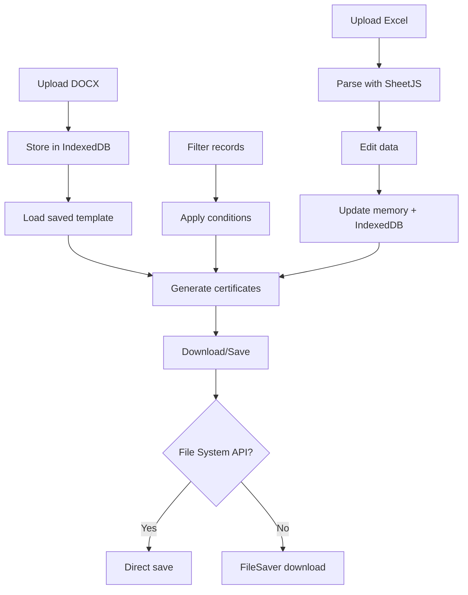

Here's your beautifully styled README.md:

```markdown
<div align="center">
  
# 🎓 Certificate Generator

**A powerful web application for batch-generating personalized certificates from Excel data and DOCX templates**


[](https://reactjs.org/)
[](https://www.typescriptlang.org/)
[](https://tailwindcss.com/)
[](https://vitejs.dev/)

</div>

---

## 📋 Table of Contents
- [✨ Features](#-features)
- [🚀 Getting Started](#-getting-started)
- [📖 How to Use](#-how-to-use)
- [🎯 Advanced Features](#-advanced-features)
- [🏗️ Technical Architecture](#️-technical-architecture)
- [🌐 Browser Support](#-browser-support)
- [📁 Project Structure](#-project-structure)
- [🔧 Configuration](#-configuration)
- [📞 Support](#-support)
- [🚧 Known Limitations](#-known-limitations)
- [🔜 Roadmap](#-roadmap)
- [📊 Performance Tips](#-performance-tips)
- [🎯 Use Cases](#-use-cases)
- [💡 Tips & Tricks](#-tips--tricks)

---

## ✨ Features

<div align="center">
  
| 📄 Template Management | 📊 Excel Data Handling | 🔍 Advanced Filtering |
|:----------------------:|:----------------------:|:---------------------:|
| Upload DOCX templates | Edit data inline | Multi-column filtering |
| Auto placeholder detection | Add/delete rows | Real-time preview |
| Save permanently | Add/delete columns | Value suggestions |
| Load instantly | Bulk CSV paste | One-click clear |

</div>

### 📄 Template Management
- **Upload DOCX templates** with placeholders like `{name}`, `{position}`, `{date}`
- **Automatic placeholder detection** - finds all placeholders in your template
- **Save templates permanently** in your browser's IndexedDB
- **Load saved templates** instantly - no need to re-upload
- **Delete unwanted templates** with one click

### 📊 Excel Data Handling
- **Upload Excel files** (.xlsx, .xls) as your data source
- **Edit data inline** with a full spreadsheet editor
  - ✏️ Add/delete rows
  - 📋 Add/delete columns
  - 🔢 Edit any cell
  - 📑 Bulk paste CSV data
  - 📎 Import additional data from files
- **Smart date conversion** - automatically converts Excel dates to readable format
- **Persistent storage** - data saves in browser database

### 🔍 Advanced Filtering
- **Multi-column filtering** with AND logic
- **Real-time preview** of filtered results
- **Value suggestions** based on actual column data
- **Active filter indicators** with one-click clear
- **Download filtered certificates** only

### 📥 Certificate Generation
- **Preview certificates** before downloading
- **Navigate through records** with Previous/Next buttons
- **Download options:**
  - 📄 Current certificate
  - 📚 Range of certificates
  - 📦 All certificates at once
- **Print certificates** individually or in batch
- **Sequential numbering** with `{CERTver-DATE_ISO}` placeholder (YYYY-MM-01 format)

### 💾 File System Integration
- **Direct file saving** using File System Access API (Chrome/Edge)
- **Fallback to download** for other browsers
- **Explicit user permission** for file modifications
- **Clear status indicators** for write access

---

## 🚀 Getting Started

### Prerequisites
```
Node.js (v14 or higher)
npm or yarn
```

### Installation

1. **Clone the repository**
   ```bash
   git clone https://github.com/jefefefef/Certifateapp.git
   cd Certifateapp
   ```

2. **Install dependencies**
   ```bash
   npm install
   # or
   yarn install
   ```

3. **Start the development server**
   ```bash
   npm run dev
   # or
   yarn dev
   ```

4. **Open your browser**
   ```
   http://localhost:5173
   ```

---

## 📖 How to Use

### Step 1: Upload a DOCX Template
1. Click the **"Upload DOCX Template"** area
2. Select a Word document with placeholders like `{name}`, `{position}`, `{date}`
3. Enter a name for your template when prompted
4. The template is saved permanently in your browser

### Step 2: Upload Excel Data
1. Click the **"Upload Excel Data"** area
2. Select an Excel file with columns matching your placeholders
3. Data is loaded and saved for the session

### Step 3: Generate Certificates
1. Preview certificates using the navigation buttons
2. Choose your download option:
   - **Download Current** - only the visible certificate
   - **Download Range** - specify a range of records
   - **Download All** - all records at once

---

## 🎯 Advanced Features

### Editing Excel Data
1. Click **"Edit Excel Data"** button
2. Modify cells, add rows/columns, or paste CSV data
3. **Enable Direct Save** (Chrome/Edge) to save back to original file, or **Download Updated File** for a new copy

### Filtering Records
1. Click **"Filter Records"** button
2. Add filter conditions (column + value)
3. See real-time preview of matching records
4. Apply filters or download filtered results

### Using Sequential Numbers
Add any placeholder ending with `-DATE_ISO` in your template for automatically incrementing numbers:

```
{CERTver-DATE_ISO}   → 2026-03-01
{CERTlang-DATE_ISO}  → 2026-03-01
{FOO-DATE_ISO}       → 2026-03-01
```

All `-DATE_ISO` placeholders share the same counter per template per month:
- **First download this month:** `2026-03-01`
- **Second download:** `2026-03-02`
- **Resets each month**

### Placeholder Modifiers
- **Uppercase**: Add `_UPPER` suffix (e.g., `{name_UPPER}`) to convert values to uppercase

---

## 🏗️ Technical Architecture

### Technologies Used

<div align="center">
  
| Frontend | Storage | File Processing | Icons |
|:--------:|:-------:|:---------------:|:-----:|
| React | IndexedDB | SheetJS (XLSX) | Lucide |
| TypeScript | LocalStorage | Docxtemplater | |
| Tailwind CSS | | Mammoth.js | |
| Vite | | FileSaver.js | |

</div>

- **React** - UI framework
- **TypeScript** - Type safety
- **Vite** - Build tool
- **Tailwind CSS** - Styling
- **IndexedDB** - Local storage for templates and data
- **LocalStorage** - Counter storage (CSV format)
- **File System Access API** - Direct file saving
- **SheetJS (XLSX)** - Excel file parsing
- **Docxtemplater** - DOCX template processing
- **Mammoth.js** - DOCX to HTML conversion
- **FileSaver.js** - File download fallback
- **Lucide React** - Icons

### Data Flow



### Key Components

#### Placeholder Detection
The app scans **ALL XML files** in the DOCX zip, including:
- `word/document.xml` (main content)
- `word/header*.xml` (headers)
- `word/footer*.xml` (footers)

#### Counter System
Sequential numbers are stored in LocalStorage as CSV:

```csv
templateId,templateName,monthKey,count
template_123,Training Certificate,2026-03,5
template_123,Training Certificate,2026-02,12
template_456,Completion Certificate,2026-03,3
```

---

## 🌐 Browser Support

| Feature | Chrome | Edge | Firefox | Safari |
|---------|:------:|:----:|:-------:|:------:|
| **Basic functionality** | ✅ | ✅ | ✅ | ✅ |
| **Direct file saving** | ✅ | ✅ | ❌ | ❌ |
| **IndexedDB** | ✅ | ✅ | ✅ | ✅ |
| **Print** | ✅ | ✅ | ✅ | ✅ |

---

## 📁 Project Structure

```
certifateapp/
├── 📁 src/
│   ├── 📄 App.tsx              # Main application component
│   ├── 📄 main.tsx             # Entry point
│   ├── 📄 index.css            # Global styles
│   └── 📄 vite-env.d.ts        # Vite type definitions
├── 📁 public/                   # Static assets
├── 📄 index.html               # HTML template
├── 📄 package.json             # Dependencies
├── 📄 tsconfig.json            # TypeScript configuration
├── 📄 vite.config.ts           # Vite configuration
├── 📄 tailwind.config.js       # Tailwind CSS configuration
├── 📄 postcss.config.js        # PostCSS configuration
└── 📄 README.md                # This file
```

---

## 🔧 Configuration

### Environment Variables
Create a `.env` file in the root directory:

```env
VITE_APP_TITLE=Certificate Generator
VITE_APP_VERSION=1.0.0
```

### Database Version
The app uses IndexedDB with version control. Update `DB_VERSION` in `App.tsx` when making structural changes:

```typescript
const DB_VERSION = 2; // Increment when changing schema
```

---

## 📞 Support

For issues or questions:

1. Check the [Issues](https://github.com/jefefefef/Certifateapp/issues) page
2. Create a new issue with detailed description
3. Include browser console logs when reporting bugs
4. Specify your browser and operating system

---

## 🚧 Known Limitations

- ⚠️ **Direct file saving** only works in Chromium-based browsers (Chrome, Edge, Opera)
- ⚠️ **Large Excel files** (>10MB) may cause performance issues
- ⚠️ **DOCX templates** with complex formatting may not preview perfectly
- ⚠️ **Counters reset** when clearing browser data
- ⚠️ **File handles** are lost when closing the browser tab (need to re-enable direct save)

---

## 🔜 Roadmap

### Planned Features
- [ ] 🌙 Dark mode support
- [ ] 📑 Multiple Excel sheets support
- [ ] 🔧 Custom placeholder functions
- [ ] ☁️ Cloud storage integration (Google Drive, Dropbox)
- [ ] 📝 Batch template editing
- [ ] 📄 PDF export option
- [ ] 📧 Email certificates directly
- [ ] 🔐 User authentication
- [ ] 📤 Template sharing
- [ ] 📊 Audit log of downloads
- [ ] 📱 QR code generation
- [ ] 🔢 Custom counter formats

### In Progress
- [ ] ⚡ Enhanced error handling
- [ ] 🚀 Performance optimizations for large datasets
- [ ] 🎨 More placeholder modifiers
- [ ] 🏷️ Template categories/tags

---

## 📊 Performance Tips

- 💾 Keep Excel files **under 10MB** for optimal performance
- 📄 Use **simple DOCX templates** without complex tables or images
- 🧹 Clear browser data periodically to remove old counters
- 🔍 Use **filtering** to work with subsets of large datasets
- 🌐 **Chrome/Edge recommended** for direct file saving feature

---

## 🎯 Use Cases

| 🏫 Educational | 💼 Corporate | 🎪 Events | 👔 HR |
|:--------------:|:------------:|:---------:|:----:|
| Generate certificates for graduates | Issue completion certificates | Create participation certificates | Generate employment verification letters |
| Course completions | Training programs | Workshop attendance | Reference letters |
| Degree conferrals | Skill certifications | Event badges | Offer letters |

---

## 💡 Tips & Tricks

<details>
<summary><b>📝 Template Design</b></summary>
<br>
Create your DOCX with placeholders like `{name}`, `{date}`, `{course}`. Keep formatting simple for best results.
</details>

<details>
<summary><b>📊 Excel Columns</b></summary>
<br>
Match column names exactly to placeholders (case-insensitive). Example: `{name}` matches "Name", "NAME", or "name" columns.
</details>

<details>
<summary><b>🔢 Sequential Numbers</b></summary>
<br>
Use `{CERTver-DATE_ISO}` anywhere in the document - even in headers! The app automatically detects it.
</details>

<details>
<summary><b>📑 Bulk Editing</b></summary>
<br>
Use the CSV paste feature for quick data entry. Format: `Name,Position,Date` with one row per record.
</details>

<details>
<summary><b>🎯 Filtering</b></summary>
<br>
Combine multiple conditions for precise record selection. All conditions use AND logic.
</details>

<details>
<summary><b>💾 Direct Save</b></summary>
<br>
Enable in Chrome/Edge for seamless workflow. Click "Enable Direct Save" in the Excel editor to grant permission.
</details>

---

<div align="center">

## Made with ❤️ for batch certificate generation

[](https://github.com/jefefefef/Certifateapp/stargazers)
[](https://github.com/jefefefef/Certifateapp/network/members)
[](https://github.com/jefefefef/Certifateapp/issues)

**[Report Bug](https://github.com/jefefefef/Certifateapp/issues)** · **[Request Feature](https://github.com/jefefefef/Certifateapp/issues)**

</div>
